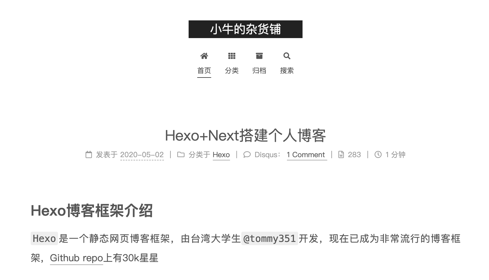

## Hexo博客框架
Hexo 是一个静态网页博客框架，简约而不简单，[Github repo](https://github.com/hexojs/hexo) 上已经有有30k星星。

<!-- more -->

什么是静态博客？通过数据库查询、调用、展示的叫做“动态”，直接生成纯 `.html` 网页文件的叫做“静态”。`Hexo`支持markdown格式文章，拥有者在本地编辑了 `.md` 格式的博文后，调用 `Hexo` 的本地库生成绚丽的静态网页后，部署到托管系统上，就可以通过其他域名访问了。

Flask  和 Django 这样的动态web框架，用来写博客这样业务逻辑十分简单的应用就有点牛刀杀鸡了。相对来说，静态博客的显然的好处就是轻量化和性价比：使用 Hexo，不用脚本语言编写复杂的服务器段逻辑；不用从数据库中拉取博文和渲染网页；不用租用服务器和数据，只需要一个免费的文件托管系统，如 Github Pages，就可以上线了。如果不满足于 Github Pages 的免费服务，可以用很少的花费租用一个域名，链接 Github Pages 的网页。

### Hexo的特性

- 完美支持Markdown

- 完美支持emoji👍

  - 如果你使用的是苹果设备，写文章时可以直接在vscode里输入emoji

- 支持代码高亮

  - Python

  ```python
  def factorial(n):
    if n=1:
      return 1
    return factorial(n-1)*n
  ```

- 一键部署到Github Page上

## NexT主题
`NexT` 是 `Hexo` 支持的众多第三方主题中的一个。当然，你不一定要用NexT这个主题，还有其他很多的主题供你选择。NexT主题订制的博客简约干净，而且有全面的用户自定义设置，你可以选择你需要哪些功能和模块，丰俭由人。

我使用的是单栏目的Mist主题，清爽干净，浏览文章的时候侧边栏显示Table of Contents，而且会随着文章向下划动，高亮当前区域在TOC中的位置。

## 搭建博客
### 安装依赖
1. Hexo是一个 `Node.js` 实现的库，所以确保你拥有
   - [`Node.js`](https://nodejs.org/en/) - macOS 提供打包好的installer
   - `git` - macOS 随机预装🎉，你也可用 `homebrew` 安装
2. 使用 `Node.js` 的 package manager `npm`
`npm install hexo`

### 创建一个博客项目
成功安装 `Hexo` 后，如果你想要把博客项目放置在`<folder>`里，运行
```bash
hexo init <folder>
cd <folder>
npm install
```
然后会得到一个结构如下的目录
```
.
.
├── _config.yml
├── node_modules
├── package-lock.json
├── package.json
├── scaffolds
├── source
    └── _posts
└── themes
```

- `_config.yml` - 控制站点的设置
  - 如何[配置](https://hexo.io/zh-cn/docs/configuration)
- `package.json` - 应用程序的信息
- `scaffolds` - 模板文件夹
  - 当我们新建文章时，Hexo 会使用模版
- `source` - 资源文件夹
  - 存放用户文章的源文件，和其他媒体资源
  - 除 `_posts` 目录外，其他以 `_` 开头的文件/文件夹都会被忽略
  - Markdown 和 HTML 文件会被解析放进 `public` 文件夹，其他的文件会被拷贝过去
- `themes` - 主题文件夹

### 安装 NexT 主题

安装 `Hexo` 的主题非常简单，只需要将主题文件拷贝到站点目录的 `themes` 目录下
```bash
cd <folder>
# 克隆最新版本
git clone https://github.com/iissnan/hexo-theme-next themes/next
```
然后启用主题。编辑 `<folder>/_config.yml`，找到 `theme` 字段，更改为

```yml
theme: next # 替换默认的landscape主题
```

NexT也有一个独立的配置文件，同站点的配置文件一样，也叫 `_config.yml`。为了描述方便，将前者称为

- 站点配置文件：`<folder>/_config.yml`
- 主题配置文件：`<folder>/themes/next/_config.yml`

我们主要通过这两个文件控制`Hexo`, `NexT`主题和其他插件的行为。

### 配置主题

NexT 提供了四个子主题 (Scheme) 供选择

- Muse - NexT的最初版本，黑白主题，大量留白
- Mist - Muse紧凑版本，整洁有序的单栏外观
- Pisces - 双栏 Scheme，小家碧玉似的清新
- Gemini

在主题配置文件，更改 Scheme 字段

```yaml
scheme: Mist #/Muse/Pisces/Gemini
```

设置网站的基本信息

```yaml
# Site
title: # 网站名称
subtitle: # 网站副标题
description: # 网站介绍
keywords: # 关键词
author: # 网站作者
language: zh-Hans # 设置语言为简体中文
timezone: # 时区
```

*Fav Icon*

想要自己的网站有个个性的图标？编辑`themes/next/_config.yml`

```yaml
favicon:
  small: /images/favicon-16x16-next.png
  medium: /images/favicon-32x32-next.png
```

`small`和`medium`分别设置为图片文件，位置在`themes/next/source/images/`下。上面两个文件是Next主题的Icon，如果想要用自己设计的Logo，把文件拷贝到同一个目录替换即可。

目前我们只需要设置这些字段，参考[Hexo站点配置](https://hexo.io/docs/configuration.html)。

### 打开浏览器试试

Hexo 的任何新建项目包含一个默认文章，如果进入目录 `<folder>/source/_posts/`，有一篇叫做 `hello-world.md` 的文章。所以，即使还不知道如何在Hexo框架下写文章，我们也可以先把网站运行起来，看看效果。


```bash
# 生产静态文件
npx hexo generate
# 启动服务器
npx hexo server
```

如果Hexo成功编译了静态网页文件，我们会看到Hexo提示网址为：`http://localhost:4000/`。浏览器打开这个网址，博客成功在本地运行⬇️。如果你没有编辑博文的话，看到的应该是默认的Hello World文章。



## 编写博客

运行

```bash
hexo new <layout> title
```

Hexo会在`source/_posts/`下创建一个`title.md`文件。可选的layout有三种，默认post

- post - 文章
- page - 页面 （如索引，自我介绍）
- draft - 草稿

编辑`title.md`。Hexo会插入一个`front-matter`设置段落，控制这篇文章的meta-data。这个段落可以是yaml格式的，用triple dash结束；也可以是json，用三个分号结束

```
title: #文章题目
toc:
  number: #是否编号
  enable: #是否显示TOC
date: 2020-05-02 18:30:55
tags: # 标签
categories: # 分类
permalink: # 文章的永久链接
comments: 
```

在`front-matter`的`---`以下编辑文章，可以使用Markdown支持的排版，包括emoji，可以插入本地照片或图床上的照片，本地照片会被Hexo打包在`public`目录中一同上传至托管系统。

## 部署博客

写好文章后，下一部就是把博客真正地部署在互联网上，让所有人都能看到。

先更新文章的HTML网页，生产文件放在`public`目录中

`hexo generate`

如果想要使用Gitub Pages部署博客。先在 Github上建立一个`<example>.github.io`的仓库，把`<example>`替换为你的Github id。

部署到Pages上有两种方法

1. 在本地部署

安装`hexo-deployer-git`插件，在站点目录中运行

```bash
npm install --save hexo-deployer-git
```

编辑站点配置文件

```yaml
deploy:
  type: 'git'
  repo: https://github.com/<example>/<example>.github.io.git
  branch: master
```

把`<example>`替换成你的Github id。

> ‼️注意，`branch`字段必须为master。Github Pages的server只能读取master分支上的文件。

运行，Hexo将`public`目录push到master分支上

```bash
hexo deploy
```

最后一步，在Github仓库的Settings中找到Github Pages，启用选择master分支。打开浏览器输入`<example>.github.io`，如果可以看到博客，说明站点部署成功。

之后每次更新博文，运行

```bash
hexo clean # 删除public文件夹和数据库
hexo generate
hexo deploy
```

或者节约时间，Hexo支持缩写命令

```bash
hexo d -g # 生成并部署
```

2. Travis部署
`Travis`是一个代码部署平台，可以与GitHub联动，监测github上某个仓库的某些分支，有commit后，寻找分支中的配置文件`.travis.yaml`，自动创建环境，允许指令部署。Travis有专门的Pages的部署选项，几个简单的配置之后就可以实现创作👉Push到仓库👉搞定。

```yaml
...
deploy:
  provider: pages
  skip-cleanup: true
  github-token: $GH_TOKEN
  keep-history: true
  commiter_from_gh: true
  target_branch: master
  on:
    branch: hexo
  local-dir: public
```
假设你的源代码存放在hexo分支，网站代码存放在master分支。
`$GH_TOKEN`指示Travis使用这个token向remote push生成的网页代码，这个token在Github的Developer settings里生成，粘贴到Travis里的环境变量配置，这个token必须有向
master分支push的权限。


## 关联域名

如果不喜欢`<example>.github.io`这样的二级域名，可以自己租用域名，然后链接到Github Page上。

租用域名的平台很多，一个选择是[阿里云](https://wanwang.aliyun.com/)。

假设租用`mydomain.com`，审核完成，到控制台/域名，找到刚刚购买的域名，配置解析，添加一条记录

- 记录类型选择CNAME，解析到网址（而不是IP）
- 主机记录
  - 输入@，就是直接解析主域名`mydomain.com`
  - 输入www，解析`www.mydomain.com`
  - 输入blog，解析`blog.mydomain.com`
- 记录值输入`<exmaple>.github.io`，`example`替换成你的Github ID


创建`source/CNAME`，内容`mydomain.com`

> 编译后，`CNAME`文件会放在`master`分支的根目录下，Page会根据这个文件里的白名单，匹配你自己域名，从而使得你可以在`mydomain.com`访问博客，而不是只能在`username.github.io`。**只配置CNAME文件是不够的**，在自己域名的管理页面（如阿里云）要配置DNS解析，增加一条CNAME类型的重定向解析，指向目标为 username.github.io

然后`hexo deploy`

你也可以直接在Github仓库的设置，填写Custom domain，Github会帮你添加CNAME在master分支的根目录下。

>  可能需要等待一会，让DNS服务器更新

访问`mydomain.com`，可以看到博客。访问`<example>.github.io`，会被重定向至`mydomain.com`。


这样，一个虽然有些简陋，但是五脏俱全的博客站点就建设完成了。

下一篇博客，笔者会讲讲如何优化Hexo博客，

## 参考来源
[Hexo 文档](https://hexo.io/docs/setup)
[NexT 文档](https://theme-NexT.iissnan.com/getting-started.html)